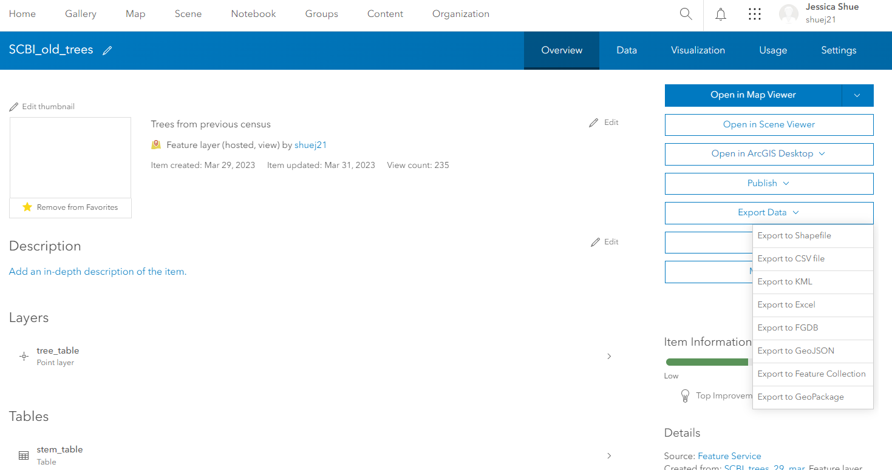
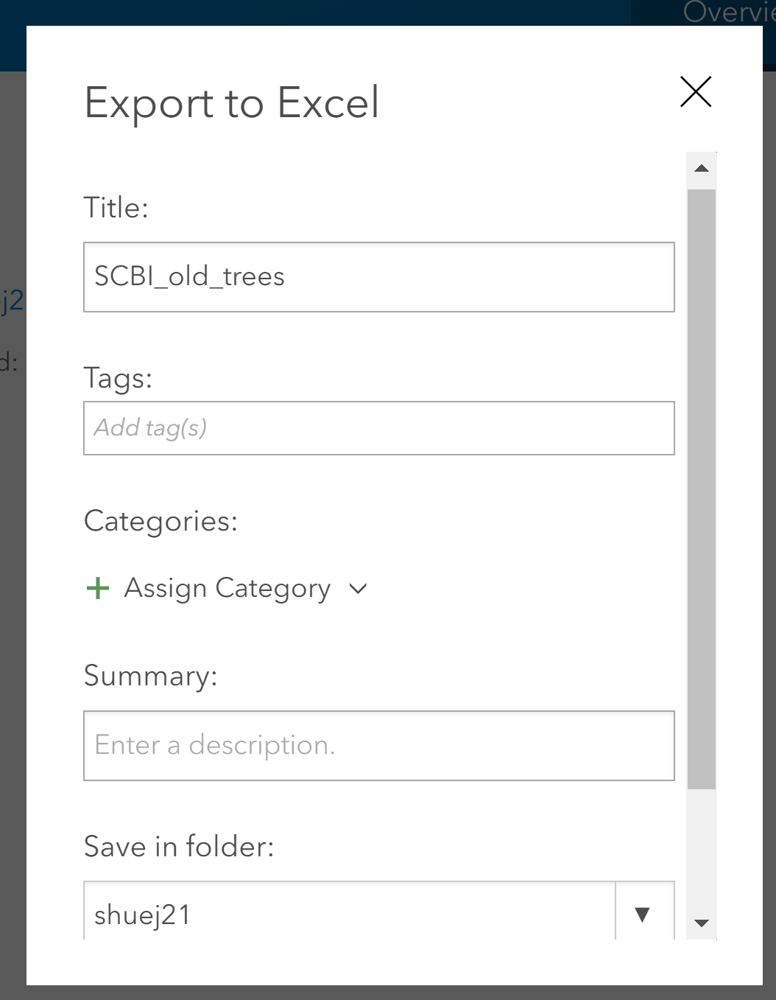
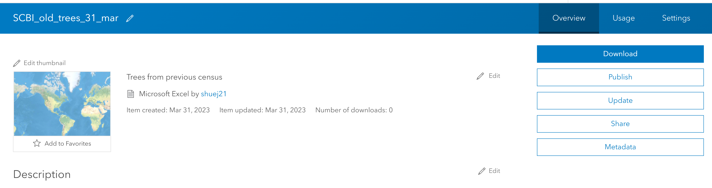

```{r setup, include=FALSE}
knitr::opts_chunk$set(echo = TRUE)
```

1. Login to [ArcGIS Online](https://www.arcgis.com/sharing/oauth2/authorize?client_id=arcgisonline&response_type=code&state=%7B%22portalUrl%22%3A%22https%3A%2F%2Fwww.arcgis.com%22%2C%22uid%22%3A%22Nk2aOyHUvP0iFszXqfGBq2_DJ911D6127YWHubSY1LU%22%2C%22useLandingPage%22%3Atrue%2C%22clientId%22%3A%22arcgisonline%22%7D&expiration=20160&locale=en&redirect_uri=https%3A%2F%2Fwww.arcgis.com%2Fhome%2Faccountswitcher-callback.html&force_login=true&redirectToUserOrgUrl=true&code_challenge=Twq0SpCW-Gbl1fJHjbGjCGQHOelMGkzV-rz29PGOGD8&code_challenge_method=S256&display=default&hideCancel=true&showSignupOption=true&canHandleCrossOrgSignIn=true&signuptype=esri&allow_verification=true)

2. Go to Groups -> SCBI Recensus 2023

3. You will need to open the old stems layers and the recruits layer separately and download the data

4. On the Overview tab, select 'Export Data' -> Export to Excel




5. In the pop-up window you can change the name to include the date and save the data to an appropriate folder (created in your ArcGIS Online account). This may take a few minutes to complete.



6. The details page for the data will open and you can select 'Download' on the right hand side. The data will then download to your computer as a .xlsx document with two tabs:  'tree_table_0' and 'stem_table_1'. There will also be tabs for recruits if any were added.



7. Data should then be saved/copied to the raw_data folder for the 2023Census on GitHub

